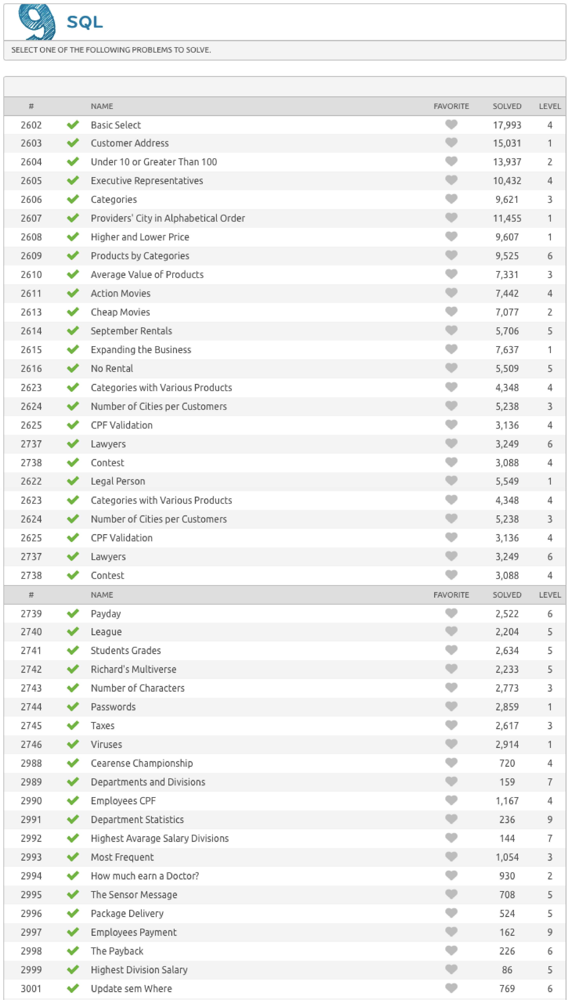

# Beecrowd SQL Solutions

*Solution to every single one of the 46 Beecrowd Challenges.*

# 📖 Project

### 👨🏻‍🏫 Introduction

Solution of all 46 SQL Problems from [Beecrowd](https://www.beecrowd.com.br/judge/en/problems/index/9) (previously called URI).

Every challenge was solved following the [SQLFluff](https://about.gitlab.com/handbook/business-technology/data-team/platform/sql-style-guide/) style guide.

### 💡 SQL Concepts

The following concepts were execised during the challenge solving:
- DATE comparisons
- DISTINCT
- REGEXP_REPLACE
- SUBSTR
- CTEs
- CONCAT 
- Subquery
- Many-to-many table relations 
- Complex Joins and Subqueries 
- COALESCE
- OVER 
- PARTITION BY

# 🗄 SQL File

- [solutions-sql-problems_beecrowd.sql](solutions-sql-problems_beecrowd.sql)

# ✅ Completed challenges

# 📦 Folder Structure

    ├── LICENSE
    ├── README.md                             <- The top-level README for developers using this project.
    ├── references                            <- Explanatory materials.
    │
    ├── solutions-sql-problems_beecrowd.sql   <- file with SQL beecrowd solutions